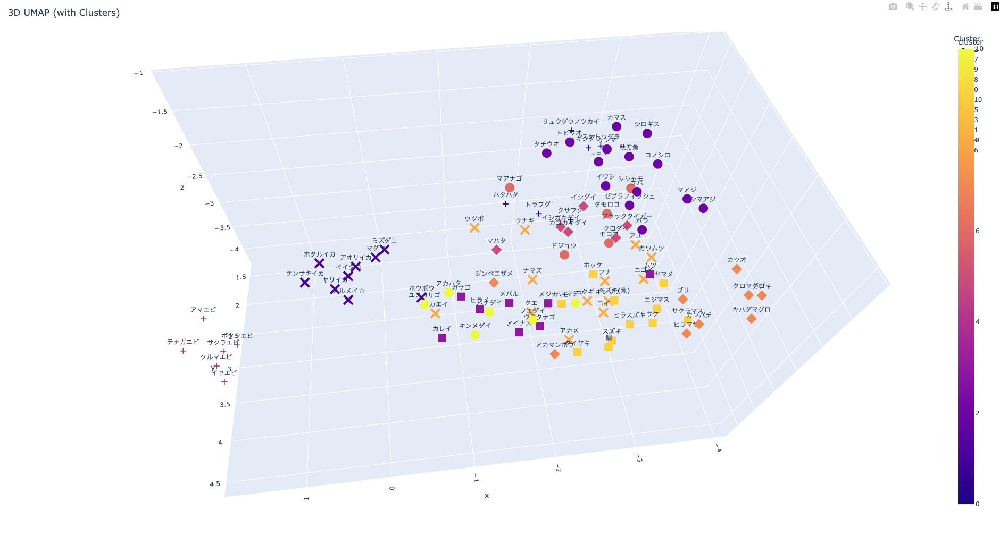

2025/7/29開催 開発者向けセミナー[『ベクトルであそぼう!』](https://youtu.be/c285zESVmRQ?list=PLzSN_5VbNaxA8mOezO6Vcm126GXw_89oN)のソースコードです。
[YouTubeリンク](https://youtu.be/c285zESVmRQ?list=PLzSN_5VbNaxA8mOezO6Vcm126GXw_89oN)
[資料PDF](https://github.com/Intersystems-jp/webinarPDF/blob/main/202507-Vector-Asobo.pdf)



## 必要環境

- InterSystems IRIS (2024.3 以降, Community Edition / Advanced Server)

- Python 3.x（venv 推奨）

※ ただし、Pythonの最新バージョン 3.13は利用できません(IRISが未対応/ sentencepieceとの互換性により)

- Jupyter Notebook


### 1. IRIS (Community Edition)


InterSystems IRIS (2024.3 以降のCommunity Edition もしくは Advanced Server が必要です。)

IRIS Community Edition のダウンロード/インストールは下記をご覧ください。

 [InterSystems IRIS／InterSystems IRIS for Health コミュニティエディションのダウンロード方法](https://jp.community.intersystems.com/post/intersystems-iris%EF%BC%8Fintersystems-iris-health-%E3%82%B3%E3%83%9F%E3%83%A5%E3%83%8B%E3%83%86%E3%82%A3%E3%82%A8%E3%83%87%E3%82%A3%E3%82%B7%E3%83%A7%E3%83%B3%E3%81%AE%E3%83%80%E3%82%A6%E3%83%B3%E3%83%AD%E3%83%BC%E3%83%89%E6%96%B9%E6%B3%95)


### 2. Python 環境

### Python のインストールについて

本プロジェクトは **Python 3.x** が必要です。

※ ただし、Pythonの最新バージョン 3.13は利用できません(IRISが未対応/ sentencepieceとの互換性により)

- Windows の方は：
[こちら](https://www.python.org/downloads/release/python-3127/) の Windows installer (64-bit) からダウンロードしてインストールしてください。

- macOS の方は Homebrew を使ってPython3.12をインストールできます：

1. Homebrew がインストールされていない場合：
```bash
/bin/bash -c "$(curl -fsSL https://raw.githubusercontent.com/Homebrew/install/HEAD/install.sh)"
```
2. Python 3.12 をインストールする
```bash
brew install python@3.12
```
3. Python 3.12 を有効化（zsh / bash に応じて）
```bash
echo 'export PATH="/opt/homebrew/opt/python@3.12/bin:$PATH"' >> ~/.zprofile
source ~/.zprofile
```
4. バージョン確認
```bash
python3.12 --version
```
 → Python 3.12.x と表示されればインストール成功です

### venv

Python の仮想環境（`venv`）を使うことで、依存関係や環境構築をプロジェクトごとに独立することができ、管理が簡単になります。

```bash

# 任意の名前(ここではfishenv)で環境を作成する
python -m venv fishenv

# 仮想環境を有効化する
fishenv\Scripts\activate     # Windows の場合
source fishenv/bin/activate  # macOS/Linux の場合

# PIPで必要なライブラリをインストールする
# (Jupyter Notebook の欄を参照ください)

# (参考)仮想環境を終了するには
deactivate
```

### 3. Jupyter Notebook
Jupyter Notebook のインストール

```bash
pip install jupyter
```

## 起動方法

* IRIS を起動します。
```bash
iris start (インスタンス名)
# もしくは、システムトレイから起動(Windowsの場合)
```

* 仮想環境を有効化します。

```bash
# 仮想環境を有効化する
fishenv\Scripts\activate     # Windows の場合
source fishenv/bin/activate  # macOS/Linux の場合

```
* notebook/iris_config.py を編集しIRISへの接続情報を記載してください。

* Jupyter Notebook を起動します。

```bash
jupyter notebook
```
* 上記コマンドを実行すると、ブラウザでJupyter Notebookが起動します。
  

* /notebook/配下のファイルをJupyter NotebookのUI上で開きます
  * Prep.ipynb, FishNameAsobo.ipynb, VisualizeVector.ipynb を実行して実験を行ってください。  
  * !pip install ... と記載された部分を実行すると、ライブラリをインストールします。
  * 実験完了後、データやテーブルが不要でしたら CleanUp.ipynbを実行してください。

## ソースコード

* notebook/iris_config.py
  * IRISへの接続情報を設定

* notebook/Prep.ipynb
  * テーブルの作成、データの登録

* notebook/FishNameAsobo.ipynb
  * 魚の写真から魚の名前をあてる実験

* notebook/VisualizeVector.ipynb
  * ベクトルの可視化 / クラスタリング / アノマリ検知

* notebook/CleanUp.ipynb
  * データの削除、テーブルの削除

## データセット

* datasets/fishname.csv
  *  魚の名前リスト

* datasets/super
  * スーパーで購入した魚の画像

* datasets/Wikipedia/image/
  * Wikipediaから取得した画像

* datasets/Wikipedia/CREDITS.md
  * ライセンス表記

